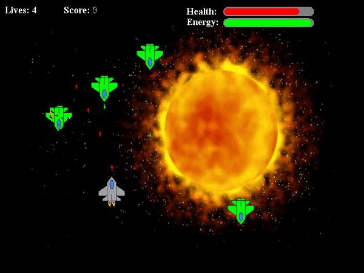



## Counter Assault \- Space Shooting Beta

### Description

Counter Assault is an arcade-style space shooter game. I intend to create advanced features such as Heat-Seeking missles, laser-powerups, bombs, and possibly even a story. It's pretty fun how it is, however. Right now, it has the basic enemy engine, enemies that move around and swurve, power-ups, such as Invincibility for 10 seconds, Health and Energy refuels. The energy system is simple: You shoot a laser, the energy of your ship goes down a little. If it reaches 0 (critical level) it takes away from your health every time you shoot. The game's completely lag free, since BLTing in DirectX is a walk in the park on even the worst computers.

Enjoy.

-Claw
 
### More Info
 
Use Space to shoot, move with he arrow keys.

Doesn't work on some kinds of DirectX versions... I have no clue why, it's just some people told me it didn't work.

             |
---                |---
**Submitted On**   |2003-11-06 12:43:42
**By**             |[Tristan Hodges](https://github.com/Planet-Source-Code/PSCIndex/blob/master/ByAuthor/tristan-hodges.md)
**Level**          |Intermediate
**User Rating**    |5.0 (10 globes from 2 users)
**Compatibility**  |VB 5\.0, VB 6\.0
**Category**       |[DirectX](https://github.com/Planet-Source-Code/PSCIndex/blob/master/ByCategory/directx__1-44.md)
**World**          |[Visual Basic](https://github.com/Planet-Source-Code/PSCIndex/blob/master/ByWorld/visual-basic.md)
**Archive File**   |[Counter\_As1668571162003\.zip](https://github.com/Planet-Source-Code/tristan-hodges-counter-assault-space-shooting-beta__1-49705/archive/master.zip)

